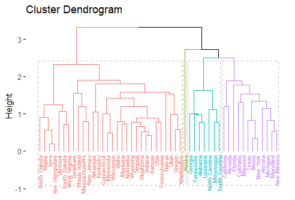
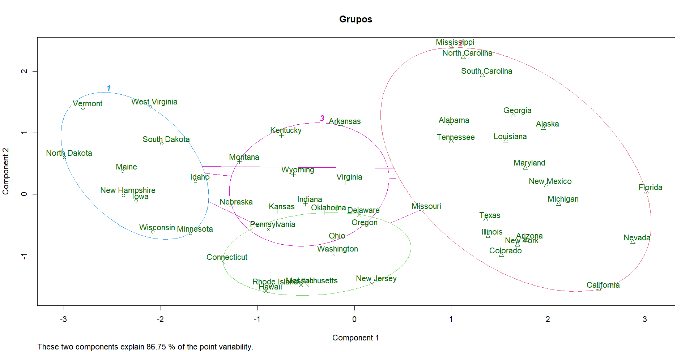

# Preparação

Para preparar o ambiente para a execução do código, primeiro deve-se instalar alguns pacotes que permitem o acesso a métodos e execução de gráficos.

São eles:

```
if(!require(factoextra)) install.packages("factoextra")
if(!require(readxl)) install.packages("readxl")
if(!require(dplyr)) install.packages("dplyr")
if(!require(car)) install.packages("car")
if(!require(psych)) install.packages("psych")
if(!require(RVAideMemoire)) install.packages("RVAideMemoire")
if(!require(pacman)) install.packages("pacman")
if(!require(pacman)) install.packages("cluster")

library(factoextra)
library(cluster)
library(readxl)
library(dplyr)
library(car)
library(psych)
library(RVAideMemoire)
library(pacman)
pacman :: p_load(dplyr, ggplot2, car, rstatix, lmtest, ggpubr, ggpmisc, psych, MASS, DescTools, QuantPsyc)
```

# Base de dados

A base de dados utilizada foi do próprio R, importada da seguinte forma:

```
data('USArrests')
dados <- USArrests
```

Nessa base de dados, é apresentado o perfil de ocorrência de determinados tipos de crime por estados dos estados unidos. A base também trás a informação da população urbana em cada um dos estados.

O perfil dos dados é:

 |       |Murder|Assault|UrbanPop| Rape| 
 |-------|------|-------|--------|-----|     
 |Min.   | 0.800|   45.0|   32.00|7.30 |
 |1st Qu.| 4.075|  109.0|   54.50|15.07|
 |Median | 7.250|  159.0|   66.00|20.10|  
 |Mean   | 7.788|  170.8|   65.54|21.23|  
 |3rd Qu.|11.250|  249.0|   77.75|26.18|
 |Max.   |17.400|  337.0|   91.00|46.00|  

Como a clusterização é uma avaliação realizada por meio da comparação entre distâncias, a dimensão dos atributos importa para o correto resultado da análise. Dessa forma, foi necessário colocar os dados em uma mesma escala, de forma que uma variável  com um valor médio maior não tenha mais influência na minha clusterização em detrimento de uma outra variável com um valor médio menor mas que explique melhor meu modelo. Em suma, colocando as variáveis em uma mesma escala, eu retiro a ponderação destas feita pela escala.

Para isso, o código realizado foi:

```
dados.p <- scale(dados)
```

# Clusterização Hierárquica

A clusterização é uma análise não supervisionada, isto é, o algoritmo realiza o agrupamento por parâmetros matemáticos e não pelo nome da amostra. 

A matemática por trás de uma clusterização avalia a distância entre cada um dos pontos, distância essa que pode ser calculada de várias formas diferentes. O R permite as seguintes para clusterização hierárquica:

|Distâncias|
|----------|
| euclidean|
|   maximum|
| manhattan|
|  canberra|
|    binary|
| minkowski|
|   pearson|
|  spearman|
|   kendall|


O código que permite a clusterização hierárquica é demonstrado a seguir:

```
d.eucl <- dist(dados.p, method = 'euclidean')
hc.m <- hclust(d.manh, method = 'average')
```

Por meio desse código, é utilizada a distância euclideana com o método da média para o cálculo dos clusteres hierárquicos. 

Uma boa forma de visualizar uma clusterização hierárquica é por meio do dendograma. Um diagrama que demonstra como acontece a separação dos grupos e qual a hierarquia dessa separação.

O dendograma gerado é demonstrado a seguir:



Por meio do diagrama é possível observar quais grupos são formados com quais componentes cortanto na altura 2.5 formando 4 grupos de componentes e como se dá a relação entre cada um dos grupos. A altura de um dendograma representa a distância entre dois grupos.

Nesse dendograma, os grupos estão separados por cores e por caixas. O gráfico foi gerado pelo seguinte comando:

```
fviz_dend(hc.m, cex = 0.5, k = groups, color_labels_by_k = TRUE, rect = TRUE)
```


# Clusterização Não Hierárquica

Para realizar a clusterização não hierárquica, foi realizado o método kmeans. Este algoritmo visa encontrar o máximo local em cada iteração onde k é a quantidade de grupos e means são as médias entre esses grupos.

A divisão dos grupos será realizada com base, nesse caso, entre as médias dos componentes desse grupo

O algoritmo é realizado em 6 passos.

1. Especificação do número de agrupamentos
2. Atribuição aleatória de dados a um cluster
3. Posicionamento de centróides 
4. Reatribuição de dados a um cluster, de forma paramétrica 
5. Re-posicionamento de centróides
6. Repetição dos passos 4 e 5 para encontrar máximos globais para o modelo.

Para a clusterização não hierárquica, os clusteres são passados para o algoritmo.

A melhor quantidade de clusteres é aquela que aumenta a homogeneidade entre os pontos internos e a heterogeneidade entre os clusteres de forma parcimoniosa.

Para gerar os clusteres, bem como o diagrama, o seguinte código foi utilizado:

```
k_means<-kmeans(dados.p, centers = groups, nstart = 1)
clusplot(dados.p, k_means$cluster, color = T, labels = 2, main = 'Grupos')
```
O gráfico clusplot vai me mostrar como o modelo separou os grupos com base nos componentes que ele criou para a avaliação e quais os componentes de cada grupo.




Código:


```
#Prova 1


# Packages

if(!require(factoextra)) install.packages("factoextra")
if(!require(readxl)) install.packages("readxl")
if(!require(dplyr)) install.packages("dplyr")
if(!require(car)) install.packages("car")
if(!require(psych)) install.packages("psych")
if(!require(RVAideMemoire)) install.packages("RVAideMemoire")
if(!require(pacman)) install.packages("pacman")
if(!require(pacman)) install.packages("cluster")

library(factoextra)
library(cluster)
library(readxl)
library(dplyr)
library(car)
library(psych)
library(RVAideMemoire)
library(pacman)
pacman :: p_load(dplyr, ggplot2, car, rstatix, lmtest, ggpubr, ggpmisc, psych, MASS, DescTools, QuantPsyc)

# Dados
data('USArrests')
dados <- USArrests

summary(dados)

#     Murder          Assault         UrbanPop          Rape      
# Min.   : 0.800   Min.   : 45.0   Min.   :32.00   Min.   : 7.30  
# 1st Qu.: 4.075   1st Qu.:109.0   1st Qu.:54.50   1st Qu.:15.07  
# Median : 7.250   Median :159.0   Median :66.00   Median :20.10  
# Mean   : 7.788   Mean   :170.8   Mean   :65.54   Mean   :21.23  
# 3rd Qu.:11.250   3rd Qu.:249.0   3rd Qu.:77.75   3rd Qu.:26.18  
# Max.   :17.400   Max.   :337.0   Max.   :91.00   Max.   :46.00  

# Entendendo um pouco melhor os dados. Eu vou precisar colocá-los em uma mesma
# escala porque estamos tratando com distâncias. Não quero que uma variável que
# com um valor médio maior tenha mais influência na minha clusterização em
# detrimento de uma outra variável com um valor médio menor que possa explicar
# melhor meu modelo

#modelo hierárquico (dendograma)

?var
# Matriz de covariâncias, como duas variáveis se relacionam, mas padronizado
p.cov <- var(scale(dados))

p.mean <- apply(dados, 2, mean)

?mahalanobis
p.mah <- mahalanobis(dados, p.mean, p.cov)

View(p.mah)

# Como não tem nenhuma variável com uma relação de variáncias distoante, 
# não irei retirar nenhuma coluna do meu dataset

# Conforme comentei antes, colocando todos os dados na mesma escala
dados.p <- scale(dados)


# Avaliando os dados por meio da distância euclideana, eu poderia utilizar
# outras, na verdade, "euclidean", "maximum", "manhattan", "canberra",
# "binary", "minkowski", "pearson", "spearman" or "kendall"
# Vou fazer a análise tanto com a distância euclideana quanto com a distância
# de manhattan.

?dist
d.eucl <- dist(dados.p, method = 'euclidean')
d.manh <- dist(dados.p, method = 'manhattan')


#Conferindo as distâncias de Manhattan
round(as.matrix(d.manh)[1:5,1:5],1) 
#Método hierárquico da variância mínima de ward ou distância média
res.hc <- hclust(d = d.manh, method = 'ward.D2')
#Matriz cofonética
res.coph <- cophenetic(res.hc)
#Correlação entre a distância cofonética e a distância original
cor(d.manh, res.coph)
#comparando o método de ligação média - distância média
hc.m <- hclust(d.manh, method = 'average')
#Correlação entre a distância cofenética (com base no método da ligação média)
#e a distância original
cor(d.manh, cophenetic(hc.m))

# Dendograma Distância de Manhattan
fviz_dend(hc.m, cex = 0.5, k = 4, color_labels_by_k = TRUE, rect = TRUE)


# Mesma coisa para distância de Euclideana
round(as.matrix(d.eucl)[1:5,1:5],1) 
res.hc <- hclust(d = d.eucl, method = 'ward.D2')
res.coph <- cophenetic(res.hc)
cor(d.eucl, res.coph)
hc.m <- hclust(d.eucl, method = 'average')
cor(d.eucl, cophenetic(hc.m))

#DENDOGRAMA Distãncia Euclideana

groups <- 4

fviz_dend(hc.m, cex = 0.5, k = groups, color_labels_by_k = TRUE, rect = TRUE)


# Sobre as distâncias, não muda muita coisa, o que varia é o método utilizado
# para gerar os resultados, dependendo do tipo de dados que se tenha é interes-
# sante utilizar uma ou outra distância. No caso desse problema, permaneço
# com a distância euclideana.

# qual a altura ideal para "cortar" o dendograma?
# Por exemplo, nesse caso a altura 3 me entrega dois grupos onde um tem uma
# porrada de indivíduos, o outro tem excessões
# talvez essa não seja uma boa altura então

# A melhor altura é aquela que cria uma quantidade parcimoniosa de grupos com
# alta homogeneidade e heterogêneos entre si


#modelo não hierárquico (kmeans)

k_means<-kmeans(dados.p, centers = groups, nstart = 1)

plot(x=dados.p[,4], y=dados.p[,3], col=k_means$cluster)
points(k_means$centers, pch=3, cex=1)

# O modelo não hierárquico não vai criar relações de "altura" entre os grupos
# A divisão dos grupos será realizada com base, nesse caso, entre as médias
# dos componentes desse grupo

# Utilizei a mesma quantidade de grupos tanto para a clusterização hierárquica
# quanto não hierárquica

clusplot(dados.p, k_means$cluster, color = T, labels = 2, main = 'Grupos')

# O gráfico clusplot vai me mostrar como o modelo separou os grupos com base
# nos componentes que ele criou para a avaliação e quais os componentes de cada
# grupo. Eu achei interessante porque mostra de forma mais clara o que foi
# agrupado junto, da mesma forma que o dendograma fez
 


```

