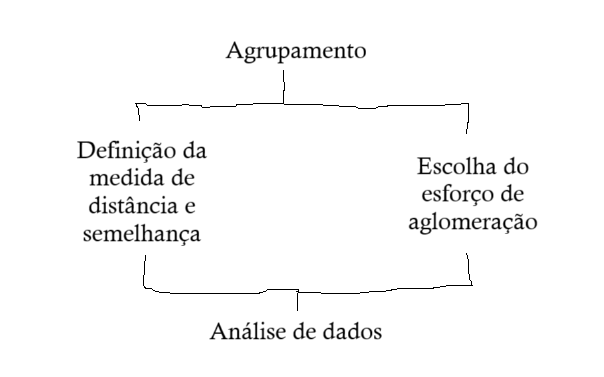
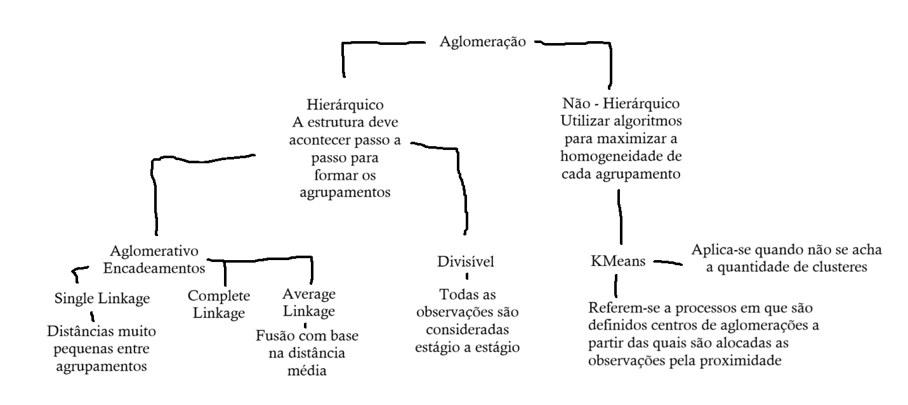

# Clusterização

## Agrupamentos

Enquanto os esquemas hierárquicos permitem a identificação do ordenamento e da alocação das observações, oferecendo possibilidades para que o pesquisador estude, avalie e decida sobre a quantidade de grupos formados.

Nos esquemas não hierárquicos, parte-se de uma quantidade conhecida de clusteres (conjunto de indivíduos que apresentam características semelhantes) e, a partid de entçao, é elsaborada a alocação das observações nesses clusteres

Esquema:

- Distância: Medida de dissimilaridade
- Semelhança: Medida de similaridade

Com base em variáveis devemos propor a quantia de clusteres

Com baseno gráfico verificamos que quanto menor a idade, menor a renda e maior a idade, maior a renda

A formação de clusteres são sensíveis à presença de outliers.

## Análise de agrupamento

- *Medida de desimilaridade (distância)*: usado quanto as variáveis do banco forem métricas, visto que quanto maior a diferença entre os valores de duas determinadas observações, menor será a similaridade e maior a dissimilaridade.
  - Distâncias diferentes
    - Euclidiana, Manhattan...

- *Medida de similaridade*: são frequentemente utilizadas em variáveis binárias, quanto maior a frequência de pares convergentes, maior a similaridade

Esquema de aglomeração 

