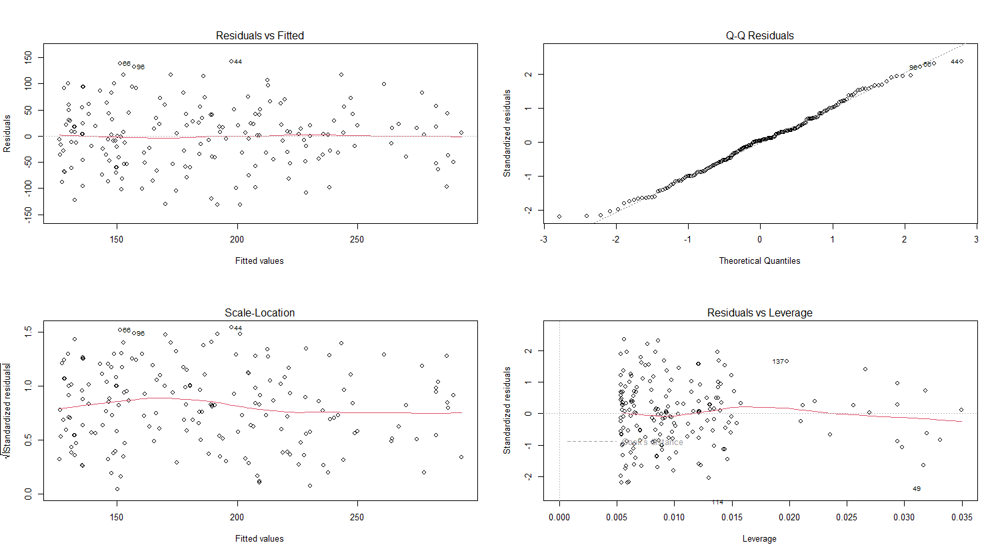

# Como realizar uma regressão?

Antes de realizar uma regressão, alguns pontos importantes são necessários de ser avaliados:

- Meus dados tem uma relação linear entre eles?
- Meu modelo é homocedástico? (Variância Constante)
  - Se um modelo não é homocedástico, sua variância não é constante e é um modelo _heterogêneo_
- Existe uma normalidade nos resíduos do meu modelo?
  - Um resíduo é tudo o que eu não tenho capacidade de explicar no modelo
- O modelo é ausente em outliers?
  
Gráficos



1. Gráfico Residuals VS. FIltered
   1. Analisa linearidade (a linha de tendência indica a linearidade entre as variáveis)
   2. quanto mais horizontal mais linear as variáveis
   3. Se fez um triângulo, é garantia que não tem linearidade no modelo 

2. Gráfico Normal QQ
   1. Resíduos normalizados pelos resíduos teóricos
   2. Caso tenhamos uma distribuição normal, os pontos devem estar na linha de tendência
   
3. Gráfico Scale-Location
   1. Avalia a homocedasticidade do modelo
   2. Quanto mais horizontal mais homocedástico
   
4. Gráfico Residuals vs leverage
   1. Avalia a presença de outliers e pontos de alavancagem
   2. Se passa de -3 a 3 é um sinal de outliers ou pontos de alavancagem


# Testes
## Shapiro
## Durbin Watson
## Breusch-Pagan


# Exemplo Regressão


Esse gráfico representa um exemplo de regressão entre duas variáveis vendas e publicidade e quais as relações entre elas.

Os parâmetros para montar esse gráfico são:

``` 
ggplot(data = dados, mapping = aes(x = Publicidade, y = Vendas))+
      geom_point()+theme_classic()+
      geom_smooth(method = 'lm', col = "red")

```

onde:

- Dados: é o nome do meu conjunto de dados
- Aes: define o rótulo dos meus eixos
- Geom_point: define o meu conjunto de pontos
- Geom_smooth: define qual será o método da minha curva de regressão (nesse caso: lm (linear) e eu pintei da cor vermelha)